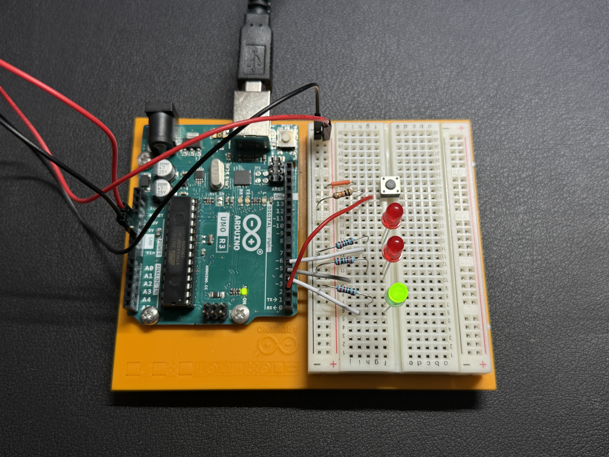
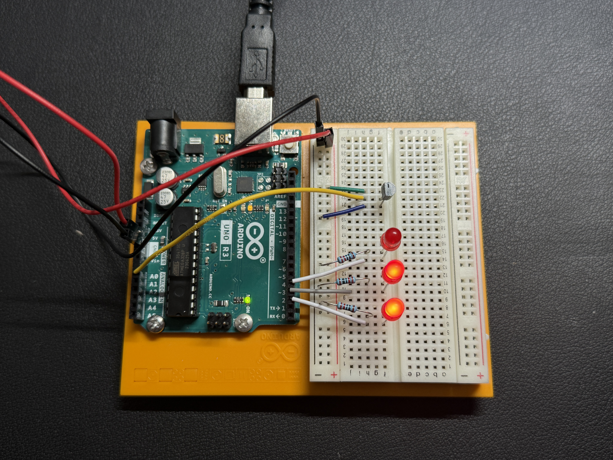
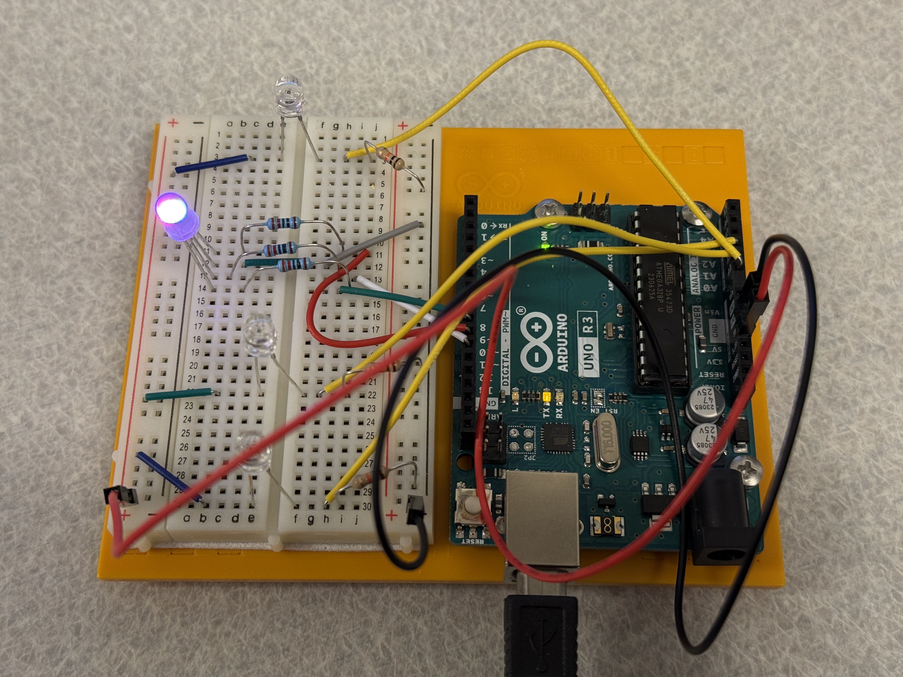
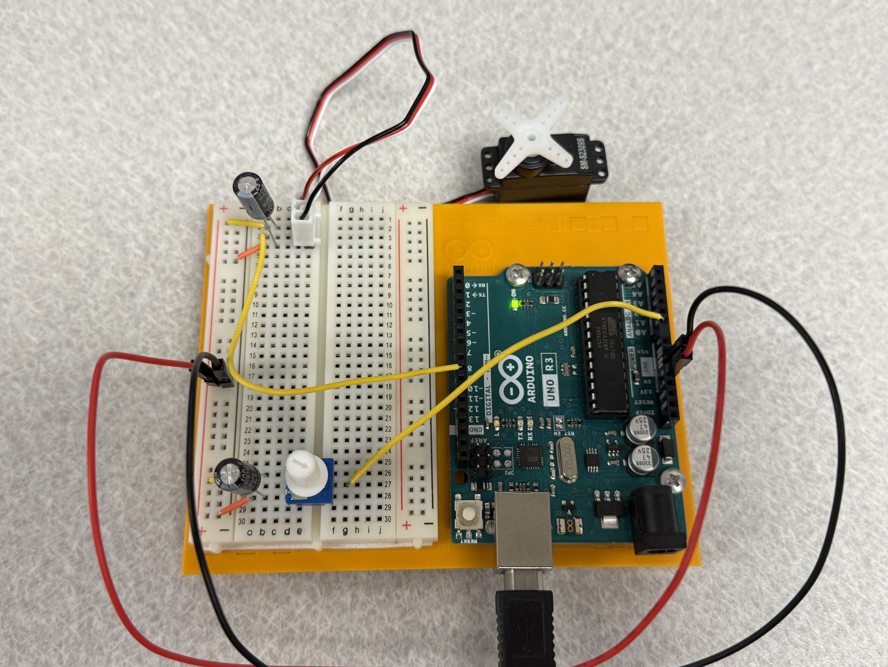
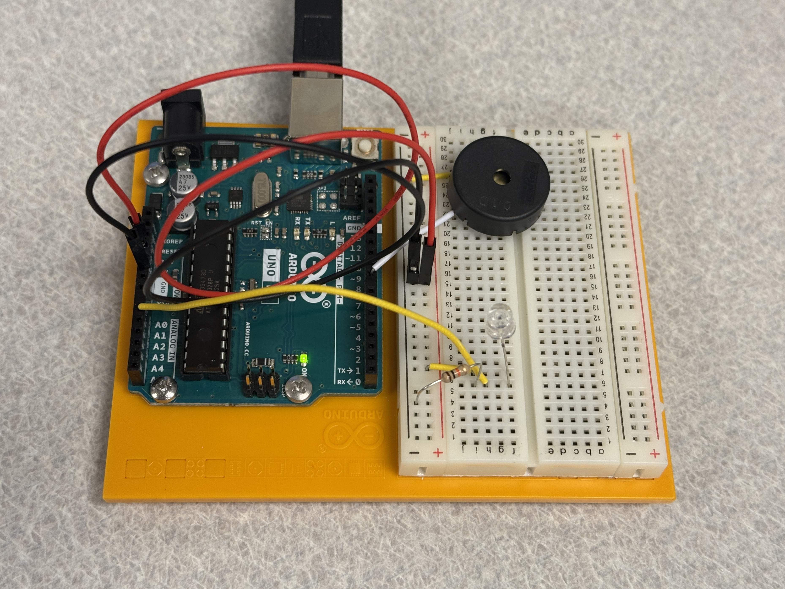
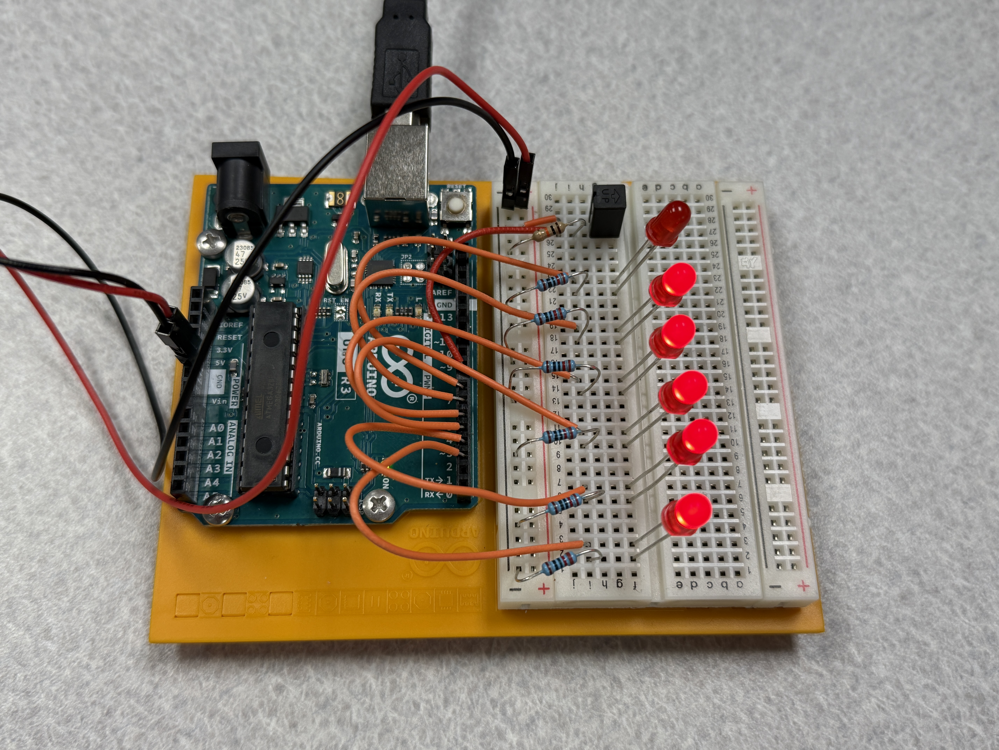
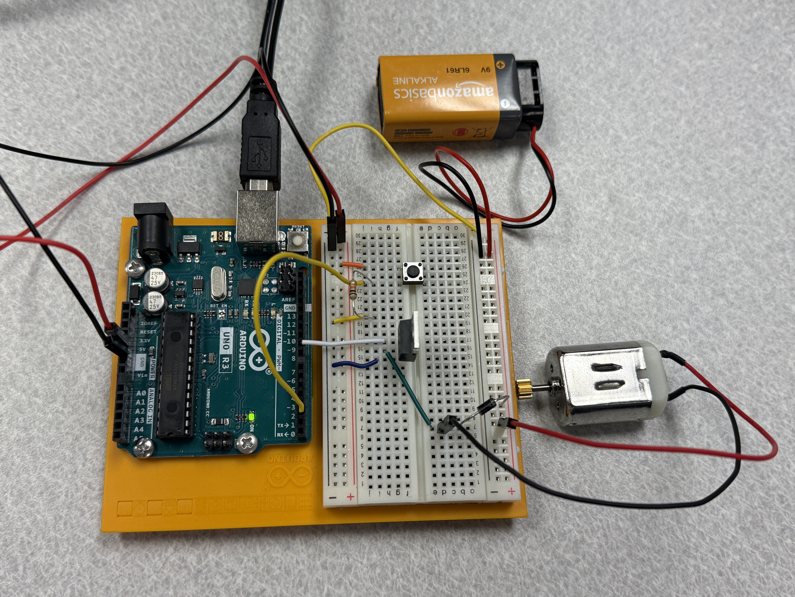
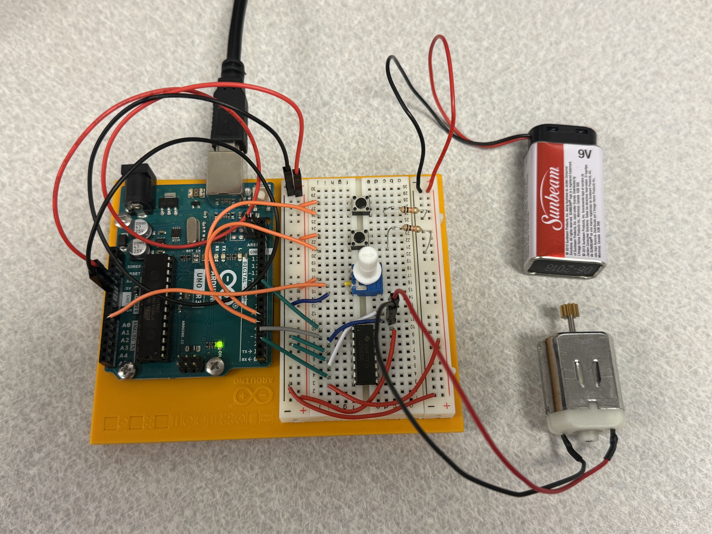
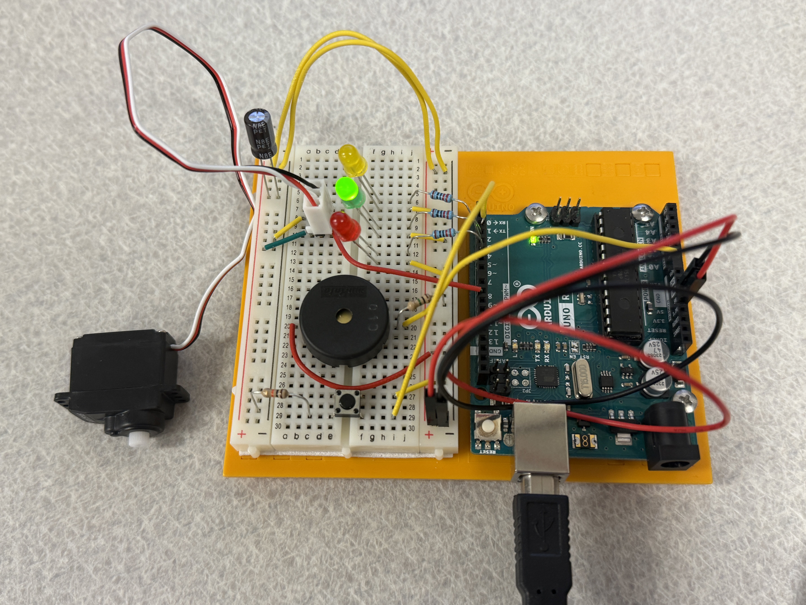
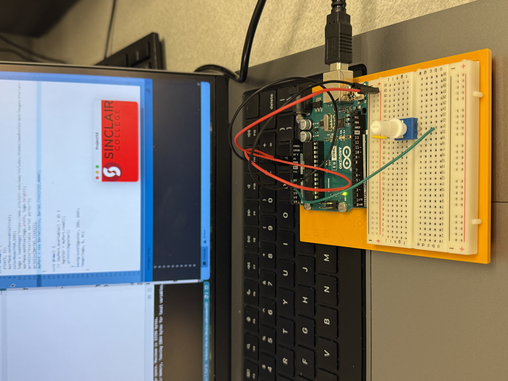

# IoT Fundamentals Projects with Arduino

This repository contains projects created during the *IoT Fundamentals* course using Arduino. Each project demonstrates basic IoT and sensor integration concepts using simple components. Most simulations are also available on Tinkercad.

## 📋 Project List

- [🚀 Project 2: Spaceship Interface](#-project-2-spaceship-interface)
- [❤️ Project 3: Love-o-Meter](#️-project-3-love-o-meter)
- [🌈 Project 4: Color Mixing Lamp](#-project-4-color-mixing-lamp)
- [😊 Project 5: Mood Cue](#-project-5-mood-cue)
- [🎶 Project 6: Light Theremin](#-project-6-light-theremin)
- [🎹 Project 7: Keyboard Instrument](#-project-7-keyboard-instrument)
- [⏳ Project 8: Digital Hourglass](#-project-8-digital-hourglass)
- [🌪️ Project 9: Motorized Pinwheel](#️-project-9-motorized-pinwheel)
- [🎞️ Project 10: Zoetrope](#️-project-10-zoetrope)
- [🔮 Project 11: Crystal Ball](#-project-11-crystal-ball)
- [🔐 Project 12: Knock Lock](#-project-12-knock-lock)
- [🖐️ Project 13: Touchy-Feely Lamp](#️-project-13-touchy-feely-lamp)
- [🎨 Project 14: Tweak the Arduino Logo](#-project-14-tweak-the-arduino-logo)

### 🚀 Project 2: Spaceship Interface

**Description:**  
In this project, your Arduino is going to star in a science fiction movie! 
Now that you understand the basics of electronics, it's time to start controlling things with the Arduino. In this project, a control panel lights up when you press a button. This project uses digital inputs and outputs, variables, and basic Arduino code.

**Tinkercad Simulation:**  
[🔗 View on Tinkercad](https://www.tinkercad.com/learn/overview/OSQKNMSISCC2EF3)

**Source Code:**  
[📄 View Arduino Sketch](./Project2/Project2.ino)

**Photo:**  

---

### ❤️ Project 3: Love-o-Meter

**Description:**  
In this project, you will turn the Arduino into a love machine!
Use a temperature sensor to measure your skin temperature, and register how hot you really are. Even though the Arduino is a digital tool, it can interpret signals from an analog input, like the temperature sensor, using the built in Analog-to-Digital (ADC) converter, accessed through the analog pins.

**Tinkercad Simulation:**  
[🔗 View on Tinkercad](https://www.tinkercad.com/learn/overview/OVANT4WISCC2EK2)

**Source Code:**  
[📄 View Arduino Sketch](./Project3/Project3.ino)

**Photo:**  

---

### 🌈 Project 4: Color Mixing Lamp

**Description:**  
In this project, you will create a lamp that changes its color depending on the room's lighting conditions. 
Shine red and blue light on a set of three light sensors, and the LED will turn purple! This project uses three analog inputs and you will watch data from the sensor in the "serial monitor."

**Tinkercad Simulation:**  
[🔗 View on Tinkercad](https://www.tinkercad.com/learn/overview/OLKSEUGISCC2EKW)

**Source Code:**  
[📄 View Arduino Sketch](./Project4/Project4.ino)

**Photo:**  

---

### 😊 Project 5: Mood Cue

**Description:**  
By ArduinoIn this project, you will use a servo motor to make a gauge that points out what mood you are in today! 
The servo is a special kind of motor that can go to a specific position and stay there. This project also uses a potentiometer, connected to an analog input, to control the position of the servo.

**Tinkercad Simulation:**  
[🔗 View on Tinkercad](https://www.tinkercad.com/learn/overview/OVSD912ISCC2EMM)

**Source Code:**  
[📄 View Arduino Sketch (with potentiometer)](./Project5/Project5.ino)

[📄 View Arduino Sketch (with ultrasonic)](./Project5/Project5-ultrasonic.ino)

**Photo:**  

---

### 🎶 Project 6: Light Theremin

**Description:**  
By ArduinoIt's time to make some noise! In this project, you will make a theremin (an instrument controlled by hand motion sensing) using a photoresistor and a piezo sound buzzer. 
You will be introduced to a new function that controls the tone or pitch of the buzzer.

**Tinkercad Simulation:**  
[🔗 View on Tinkercad](https://www.tinkercad.com/learn/overview/OF1PIRKISCC2EOG)

**Source Code:**  
[📄 View Arduino Sketch](./Project6/Project6.ino)

**Photo:**  

---

### 🎹 Project 7: Keyboard Instrument

**Description:**  
By ArduinoIn this project, you will make a small musical keyboard using buttons and the piezo buzzer. 
You will use a new technique called a "resistor ladder." Each button you press will provide a different voltage to an analog input pin.

**Tinkercad Simulation:**  
[🔗 View on Tinkercad](https://www.tinkercad.com/learn/overview/OP98ET3ISCC2EQ5)

**Source Code:**  
[📄 View Arduino Sketch](./Project7/Project7.ino)

**Photo:**  

---

### ⏳ Project 8: Digital Hourglass

**Description:**  
By ArduinoIn this project, you will build a clock that turns an LED on every ten minutes. 
The clock uses the Arduino Uno's built in timer. Reset the clock the same way you would reset an hourglass: by tilting it back and forth!

**Tinkercad Simulation:**  
[🔗 View on Tinkercad](https://www.tinkercad.com/learn/overview/OJ4LFOTISCC2ESG)

**Source Code:**  
[📄 View Arduino Sketch](./Project8/Project8.ino)

**Photo:**  

---

### 🌪️ Project 9: Motorized Pinwheel

**Description:**  
By ArduinoIn this project, you will spin a colorful pinwheel using a motor! 
The motor requires high current, so using one in an Arduino project is more complex than lighting up LEDs. You will be using a new component called a transistor to control the motor.

**Tinkercad Simulation:**  
[🔗 View on Tinkercad](https://www.tinkercad.com/learn/overview/OKS5OPOISCC2EUJ)

**Source Code:**  
[📄 View Arduino Sketch](./Project9/Project9.ino)

**Photo:**  

---

### 🎞️ Project 10: Zoetrope

**Description:**  
By ArduinoIn this project, you will make a moving image using a series of still images that rotate around a spindle.
Not only will you use a motor to rotate the series of images, you will also be able to run the motor backwards using an integrated circuit called an H-bridge.

**Tinkercad Simulation:**  
[🔗 View on Tinkercad](https://www.tinkercad.com/learn/overview/O73WOLIISCC2EWG)

**Source Code:**  
[📄 View Arduino Sketch](./Project10/Project10.ino)

**Photo:**  

---

### 🔮 Project 11: Crystal Ball

**Description:**  
By ArduinoIn this project, you will create something similar to a magic 8 ball! 
Ask it a yes or no question, press a button, and a liquid crystal display will tell you if your future is bright. You can even write your own responses to display.

**Tinkercad Simulation:**  
[🔗 View on Tinkercad](https://www.tinkercad.com/learn/overview/OB3B767ISCC2VA9)

**Source Code:**  
[📄 View Arduino Sketch](./Project11/Project11.ino)

**Photo:**  

---

### 🔐 Project 12: Knock Lock

**Description:**  
By ArduinoMake your own secret knocking mechanism in this project! 
A piezo buzzer usually creates vibrations, but this time you will use it as an input to detect how many times someone knocks on your door. You can take things a step further and automatically open a box with a servo motor if someone knocks the right number of times!

**Tinkercad Simulation:**  
[🔗 View on Tinkercad](https://www.tinkercad.com/learn/overview/OP6T6C6ISCC2VBC)

**Source Code:**  
[📄 View Arduino Sketch](./Project12/Project12.ino)

**Photo:**  

---

### 🖐️ Project 13: Touchy-Feely Lamp

**Description:**  
By ArduinoIn this project, you will create a light that turns on and off when you touch a strip of conductive material. 
The switch works based on capacitive sensing - your skin becomes part of the circuit!

**Tinkercad Simulation:**  
[🔗 View on Tinkercad](https://www.tinkercad.com/learn/overview/ONY3E9VISCC2VBZ)

**Source Code:**
[📄 View Arduino Sketch](./Project13/Project13.ino)

**Photo:**  

---

### 🎨 Project 14: Tweak the Arduino Logo

**Description:**  
By ArduinoIn this project, you can use your Arduino to control your computer! 
You will take full advantage of the serial communication between the Arduino and your computer to change the color of an Arduino logo. This project requires your physical Arduino kit.

**Tinkercad Simulation:**  
[🔗 View on Tinkercad](https://www.tinkercad.com/learn/overview/O3MXP6GISCC2VCN)

**Source Code:**  
[📄 View Arduino Sketch](./Project14/Project14.ino)

**Photo:**  

## 🛠 Requirements

- Arduino Uno
- Basic electronics components (breadboard, sensors, etc.)
- Tinkercad account (optional for simulation)

## 📜 License

This project is licensed under the [MIT License](LICENSE). Feel free to use or modify it.
